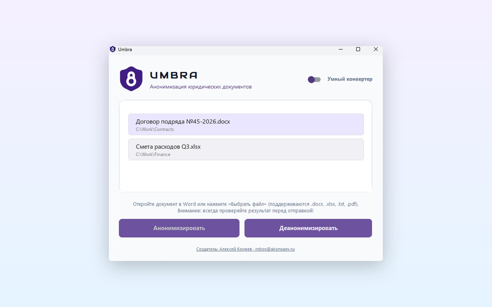

# Umbra

**Umbra** — это локальная десктоп-утилита для Windows, предназначенная для **анонимизации** юридических документов (`.docx`, `.pdf`, `.xlsx`, `.txt`, `.md`). Программа заменяет чувствительные данные на категорийные метки (например, `[ФИО_1]`, `[ОРГАНИЗАЦИЯ_2]`), а также умеет **деанонимизировать** их — подставлять реальные данные обратно в документ (например, при обработке ответа от ИИ).



## ✨ Особенности
* **Работает полностью офлайн:** без интернета и серверов, данные никогда не покидают компьютер.
* **Универсальность:** подходит для любых документов, договоров и соглашений.
* **Поддержка Markdown:** полная поддержка экспорта в `.md` для удобной передачи текста нейросетям.

## 💻 Технологии
* **Язык:** Python 3.14 (64-бит)
* **Интерфейс:** `customtkinter` (с поддержкой Drag-and-Drop через `windnd`)
* **NLP (Обработка текста):** `navec` (эмбеддинги), `slovnet` (NER), `razdel` (проект Natasha)
* **Работа с документами:** `python-docx`, `pypdf`, `openpyxl`, `markdown-it-py`
* **Взаимодействие с ОС:** `pywin32`, `psutil` (поиск и детекция открытых файлов)
* **Сборка:** `PyInstaller` (в один файл)

## 📁 Структура проекта
* `Umbra.exe` — готовая скомпилированная программа.
* `src/` — папка со скриптами, моделями и исходниками интерфейса.

## 🚀 Установка и запуск (для пользователей)

1. Скачайте файл `Umbra.exe` из раздела **Releases** на GitHub (или прямо из корневой папки этого репозитория).
2. Поместите файл в любую удобную папку на вашем компьютере.
3. Просто запустите `Umbra.exe` двойным кликом мыши. 
   *(При первом запуске программе может потребоваться несколько секунд для распаковки встроенных нейросетей, это нормально).*

---

## 🛠 Как собрать проект из исходников (для разработчиков)
1. Убедитесь, что установлен Python 3.14 и зависимости (`requirements.txt`).
2. Перейдите в папку с кодом:
   ```cmd
   cd src
   ```
3. Запустите скрипт сборки:
   ```cmd
   python build.py
   ```
   Готовый `Umbra.exe` будет автоматически перемещен в корневую папку, заменив старую версию.
