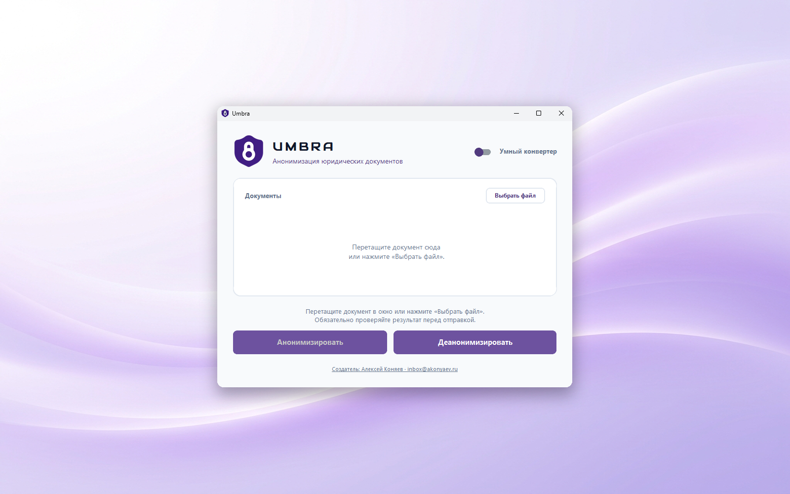

# 🛡️ Umbra - умный анонимайзер юридических документов без выхода в интернет


**Umbra** — это локальная кроссплатформенная утилита для безопасной анонимизации юридических документов. Программа находит чувствительные данные (ПДн) и заменяет их на безопасные метки (например, `[ФИО_1]`, `[ОРГАНИЗАЦИЯ_2]`), позволяя вам отправлять документы в нейросети, не нарушая соглашения о неразглашении и Федеральный закон «О персональных данных» № 152-ФЗ. Получив ответ от ИИ, Umbra автоматически подставит настоящие данные обратно.



## ✨ Ключевые возможности

* 🔒 **Полная приватность (Офлайн):** Вся обработка текста происходит строго на вашем устройстве с помощью встроенной нейросети `slovnet`. Документы и извлеченные данные никуда не отправляются.
* ⬛ **Физическая очистка PDF:** При работе с PDF-файлами программа не просто извлекает текст, а накладывает настоящие черные квадраты поверх персональных данных, полностью удаляя их из метаданных и скрытых слоев документа.
* 🔄 **Умное восстановление:** Рядом с файлом создается криптографический паспорт `*.umbra.json`. Перетащите ответ от ИИ обратно в программу — и она подставит оригинальные имена, даты и названия на место меток. *(Для исходных файлов PDF восстановленный ответ будет сохранен в формате `.docx` или `.txt`, так как жесткая верстка PDF не позволяет органично перестроить макет под новый сгенерированный текст).*
* 🛡️ **Санитайзер документов:** Защитный барьер автоматически вырезает вредоносные макросы, внешние ссылки, скрытые вложения и формулы из загруженных OOXML-документов.
* 📁 **Поддержка форматов:** Работает с `.docx`, `.pdf`, `.xlsx`, `.txt`, `.csv`, `.html`. 
* 🖱️ **Простота использования:** Поддержка Drag-and-Drop (на Windows) — просто перетащите файл в окно программы.

## ⚙️ Как это работает

1. **Анонимизация:** Перетащите ваш документ (например, `Договор.docx`) в Umbra. Программа создаст безопасную копию `[ANON] Договор.docx`.
2. **Работа с ИИ:** Отправьте текст из `[ANON]` файла в вашу любимую нейросеть и попросите её составить ответ, анализ или резюме.
3. **Деанонимизация:** Сохраните ответ нейросети в файл (например, `Ответ.docx`) и перетащите его в окно Umbra. Программа вернет оригинальные данные на место меток.

*(Примечание: Алгоритмы ИИ могут пропускать некоторые неочевидные ПДн. Всегда проверяйте обезличенный текст перед отправкой третьей стороне).*

## 💻 Системные требования

* **Свободное место на диске:** ~500 МБ (включает встроенные модели нейросети для полностью автономной офлайн-работы).
* **Оперативная память (RAM):** минимум 4 ГБ (рекомендуется 8 ГБ) для быстрой работы NLP-алгоритмов.
* **Интернет:** Не требуется (все модели уже вшиты в дистрибутив).

## 🚀 Установка (Для пользователей)

Вам не нужно устанавливать Python или разбираться в коде. Просто скачайте готовое приложение:

1. Перейдите в раздел [Releases](../../releases) на GitHub.
2. Скачайте архив для вашей системы (`Umbra-Windows.zip`, `Umbra-macOS.zip` или `Umbra-Linux.zip`) и распакуйте его.
3. Запустите приложение:
   - **Windows:** запустите `Umbra.exe`.
   - **macOS:** запустите `Umbra.app`. *(При первом запуске кликните правой кнопкой мыши и выберите «Открыть», чтобы обойти защиту системы).*
   - **Linux:** запустите файл `Umbra`.

> **Важно:** При первом запуске может потребоваться от 5 до 15 секунд для загрузки моделей нейросети в оперативную память — это нормально.

## ❓ FAQ и Возможные проблемы

> [!WARNING]
> **Нейросеть (ChatGPT/Claude) изменила формат меток.**
> Иногда ИИ при генерации ответа может случайно исказить метку, например, превратить `[ФИО_1]` в `[ФИО 1]` или удалить скобки. Если Umbra не сможет распознать метку из-за опечатки ИИ, она оставит ее в тексте как есть. **Решение:** Проверьте итоговый файл и вручную поправьте сломанную метку перед повторной деанонимизацией.

> [!NOTE]
> **macOS пишет, что приложение повреждено.**
> Это стандартная реакция Gatekeeper на приложения без цифровой подписи Apple разработчика. Откройте терминал и выполните команду: `xattr -cr /Путь/к/Umbra.app`, после чего запустите приложение снова.

> [!NOTE]
> **Linux-версия не запускается.**
> Убедитесь, что у вас установлены системные библиотеки для работы GUI (Tkinter) и PyMuPDF. На Ubuntu/Debian может потребоваться: `sudo apt install libxcb-xinerama0 python3-tk`.

---
## 🛠 Сборка из исходников (Для разработчиков)

Проект написан на Python 3.12 (64-bit) с использованием `customtkinter` для UI и оборачивается в исполняемый файл через `PyInstaller`.

1. Установите зависимости:
   ```cmd
   cd src
   python -m pip install -r requirements.txt
   ```
2. Соберите исполняемый файл:
   ```cmd
   python build.py
   ```
3. Готовый `Umbra.exe` (или аналог для вашей ОС) появится в корневой папке проекта.

---

## 📄 Лицензия

Copyright (c) 2026 Алексей Коняев

Umbra распространяется под лицензией **GNU AGPL v3** (см. файл [`LICENSE`](LICENSE)).
Причина именно AGPL: программа использует библиотеку **PyMuPDF** для физической
закраски PDF, а PyMuPDF лицензирована под AGPL — она обязывает всю поставку быть
под совместимой открытой лицензией. Исходники Umbra и так открыты, поэтому AGPL v3
приводит формальную лицензию в соответствие с фактическим положением дел.

---

## 💬 Обратная связь и баг-репорты

Нашли ошибку? Есть идея, как сделать Umbra лучше? Или просто хотите оставить отзыв?
Пожалуйста, заполните **[Форму обратной связи](https://forms.gle/HwoNVkTcZq1vZQzo7)**. Это займет всего пару минут, а ваше мнение очень поможет развитию проекта!
